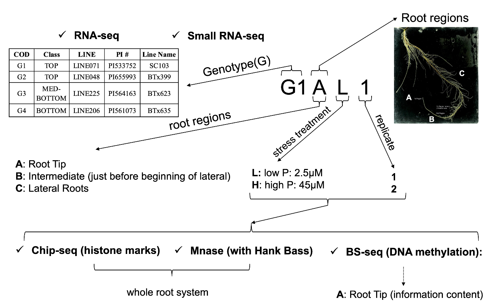

# Sorghum_phosphorus

   The objective is to find epigenetic marks related to root system morphology and architecture in sorghum. Four sorghum lines were selected based on contrasting root phenotypes and also other traits related to abiotic stress tolerance. The experimental design consisted of four sorghum lines cultivated in hydroponics under sufficient and insufficient phosphorus supply with two replications.

